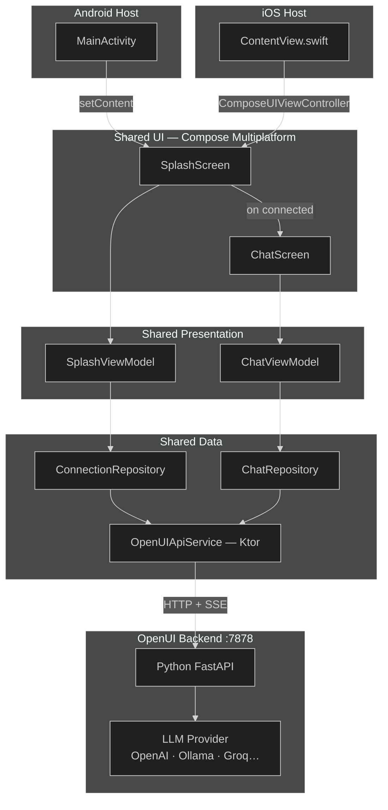
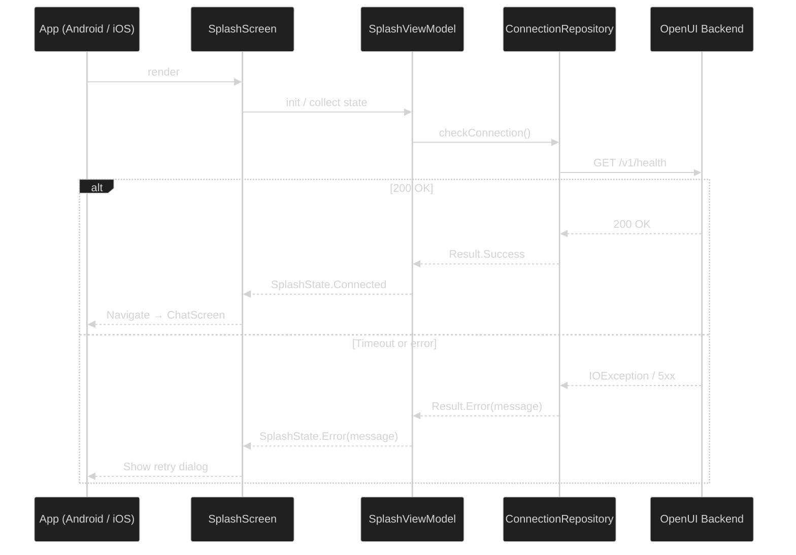
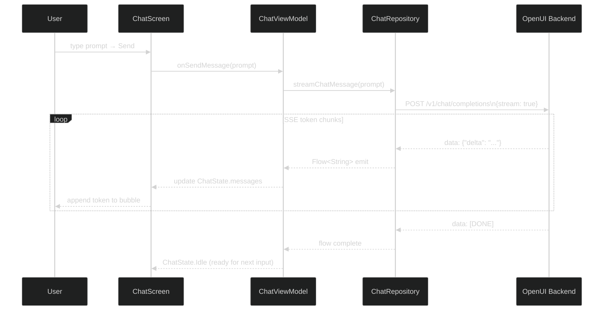
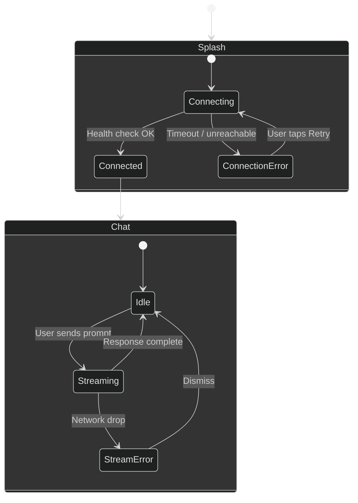

# OpenUI KMP Mobile App

A **Kotlin Multiplatform (KMP)** mobile application for Android and iOS that connects to a self-hosted [OpenUI](https://github.com/wandb/openui) backend — an open-source tool that lets you describe UI using your imagination and see it rendered live through a conversational LLM interface.

---

## Overview

OpenUI runs as a local Python server (port `7878`) backed by any LLM (OpenAI, Anthropic, Ollama, Groq, etc.). This app provides a native mobile front-end for that server:

1. A **splash screen** is shown while the app establishes a connection to the backend.
2. Once connected, a **chat window** opens where the user types prompts and receives streamed UI generation results.

---

## Tech Stack

| Layer | Technology |
|---|---|
| Shared code (logic + UI) | Kotlin Multiplatform + Compose Multiplatform |
| Android host app | Jetpack Compose (Material 3) |
| iOS host app | SwiftUI shell + Compose Multiplatform views |
| HTTP client | Ktor (multiplatform) |
| Streaming | Server-Sent Events (SSE) via Ktor |
| Async / state | Kotlin Coroutines + `StateFlow` |
| DI | Koin (multiplatform) |
| Serialization | `kotlinx.serialization` |
| Build | Gradle 8 + Kotlin 2.x |

> **UI sharing strategy:** Compose Multiplatform is used for all shared screens (Splash, Chat). Each platform host (Android Activity / iOS `UIHostingController`) embeds these composables. Platform-native chrome (status bar tinting, edge-to-edge, safe-area insets) is handled per-platform via `expect/actual`.

---

## Repository Structure

```
openui-explore/
├── shared/                        # KMP shared module (logic + UI)
│   ├── commonMain/
│   │   ├── data/
│   │   │   ├── model/             # ChatMessage, ChatSession, UIComponent
│   │   │   ├── network/           # Ktor client, OpenUIApiService
│   │   │   └── repository/        # ConnectionRepository, ChatRepository
│   │   ├── presentation/
│   │   │   ├── splash/            # SplashViewModel, SplashState
│   │   │   └── chat/              # ChatViewModel, ChatState, ChatUiEvent
│   │   └── ui/
│   │       ├── splash/            # SplashScreen composable
│   │       └── chat/              # ChatScreen, MessageBubble composables
│   ├── androidMain/               # Android actuals (HttpClient engine, etc.)
│   └── iosMain/                   # iOS actuals
├── androidApp/                    # Android application module
│   └── MainActivity.kt            # Sets content to shared SplashScreen
└── iosApp/                        # Xcode project
    └── ContentView.swift          # Hosts shared Compose UI via ComposeUIViewController
```

---

## Architecture

The app uses a strict **layered architecture** inside the shared KMP module:

```
UI (Compose) → ViewModel → Repository → Network (Ktor) → OpenUI Backend
```

All layers except the Ktor engine `actual` implementations are in `commonMain` and shared between platforms.

---

### High-Level Component Diagram



---

### App Launch & Connection Flow



---

### Chat & Streaming Flow



---

### Screen & State Machine



---

## Key Design Decisions

### 1. Splash Screen Purpose
The splash screen is not just decorative — it actively pings the OpenUI backend. No navigation to the chat screen occurs until the connection is confirmed. This prevents the user from reaching a broken chat experience.

### 2. SSE Streaming
OpenUI uses the OpenAI-compatible `POST /v1/chat/completions` endpoint with `"stream": true`, responding with `text/event-stream`. Ktor reads the byte channel incrementally and emits parsed chunks into a Kotlin `Flow<String>`, keeping the UI reactive without blocking.

### 3. Backend URL Configuration
The backend URL is configurable. Default values differ by platform:

| Context | Default URL |
|---|---|
| Android Emulator | `http://10.0.2.2:7878` (`10.0.2.2` = host `localhost`) |
| iOS Simulator | `http://localhost:7878` |
| Physical device (both) | LAN IP of the machine running OpenUI, e.g. `http://192.168.1.x:7878` |

A settings screen (post-MVP) will allow the user to enter a custom URL at runtime.

### 4. Compose Multiplatform for UI Sharing
Rather than writing separate Compose (Android) and SwiftUI (iOS) screens, Compose Multiplatform targets both platforms from `commonMain`. The iOS app wraps the shared composable in a `ComposeUIViewController`. This maximises code sharing while still letting each platform handle its own navigation chrome and OS-level integration via `expect/actual`.

---

## OpenUI API Endpoints Used

| Endpoint | Method | Purpose |
|---|---|---|
| `/v1/health` | `GET` | Splash: verify backend is reachable |
| `/v1/models` | `GET` | Chat: populate model selector |
| `/v1/chat/completions` | `POST` (SSE) | Chat: stream LLM response |

---

## Build Requirements

| Requirement | Version |
|---|---|
| Android Studio | Jellyfish+ |
| Xcode | 15+ |
| Kotlin | 2.0+ |
| Gradle | 8.x |
| Android minSdk | 26 |
| iOS deployment target | 16.0+ |
| OpenUI backend | Self-hosted Docker or `openui.fly.dev` |

---

## Running the Backend (Docker — quickest)

```bash
# Set at least one LLM API key
export OPENAI_API_KEY=sk-...

docker run --rm -p 7878:7878 \
  -e OPENAI_API_KEY \
  ghcr.io/wandb/openui
```

The app will connect to `http://<host>:7878`. The live public demo at `https://openui.fly.dev` can also be used as the backend URL during development (requires GitHub login for quota enforcement).
