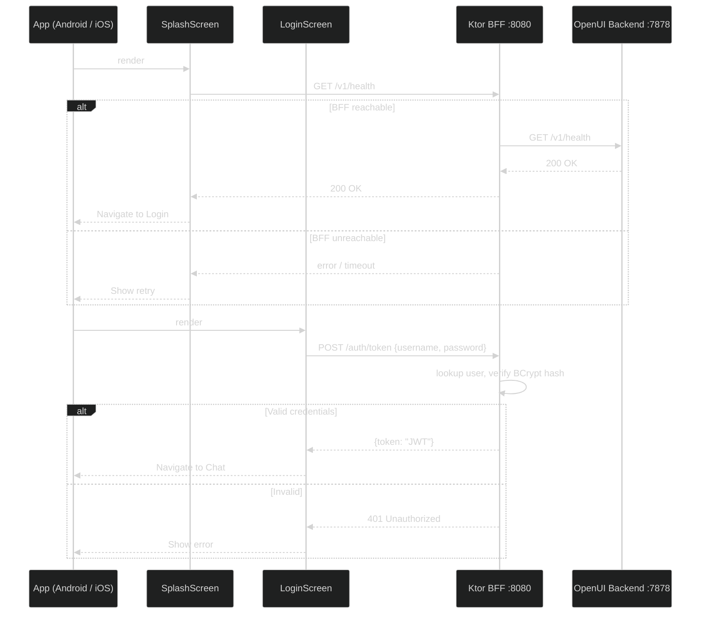
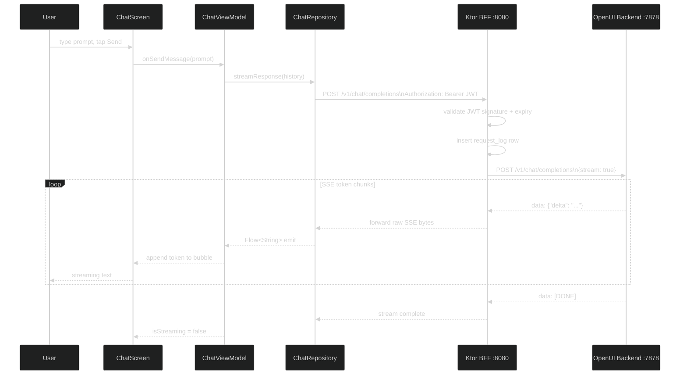
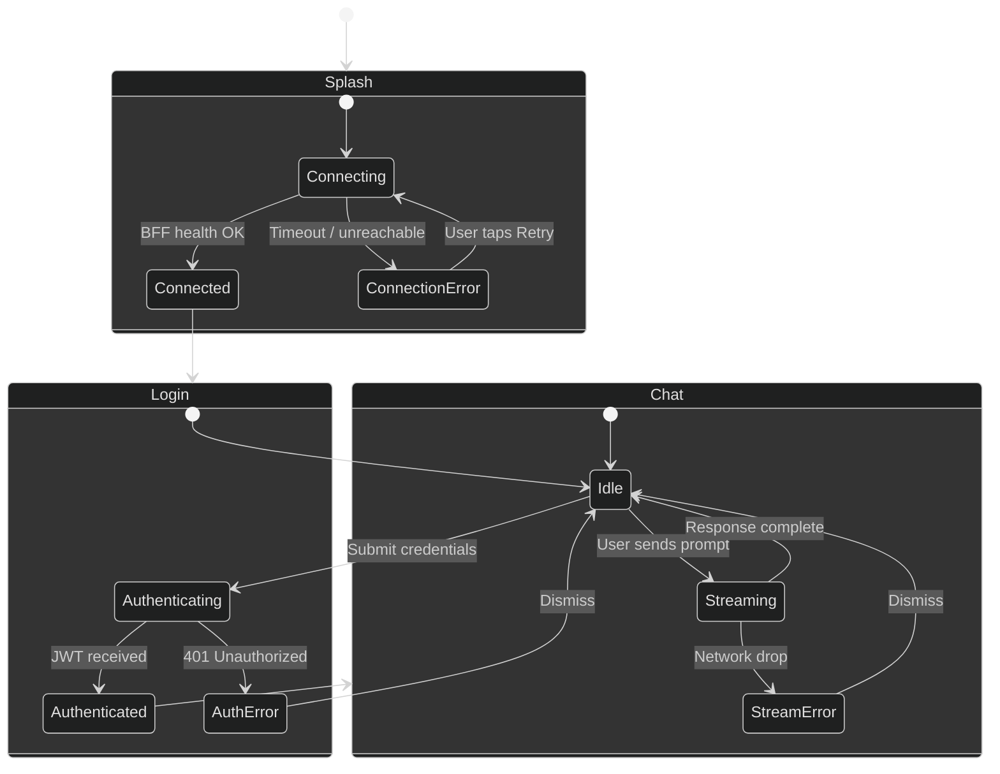

# OpenUI KMP Mobile App

A **Kotlin Multiplatform (KMP)** mobile application for Android and iOS that connects to a self-hosted [OpenUI](https://github.com/wandb/openui) backend — an open-source tool that lets you describe UI using your imagination and see it rendered live through a conversational LLM interface.

---

## Overview

OpenUI runs as a local Python server (port `7878`) backed by any LLM (OpenAI, Anthropic, Ollama, Groq, etc.). This app provides a native mobile front-end for that server:

1. A **splash screen** is shown while the app establishes a connection to the backend.
2. Once connected, a **chat window** opens where the user types prompts and receives streamed UI generation results.

---

## Tech Stack

| Layer | Technology |
|---|---|
| Shared code (logic + UI) | Kotlin Multiplatform + Compose Multiplatform |
| Android host app | Jetpack Compose (Material 3) |
| iOS host app | SwiftUI shell + Compose Multiplatform views (future) |
| BFF (Backend for Frontend) | Ktor 3 (JVM, standalone Gradle project) |
| BFF auth | JWT (HMAC-256) via `ktor-server-auth-jwt` |
| BFF database | SQLite via Exposed ORM |
| BFF migrations | Flyway (SQL files, classpath-based) |
| HTTP client | Ktor (multiplatform) |
| Streaming | Server-Sent Events (SSE) via Ktor |
| Async / state | Kotlin Coroutines + `StateFlow` |
| DI | Koin (multiplatform) |
| Serialization | `kotlinx.serialization` |
| Build | Gradle 8 + Kotlin 2.x |

> **UI sharing strategy:** Compose Multiplatform is used for all shared screens (Splash, Chat). Each platform host (Android Activity / iOS `UIHostingController`) embeds these composables. Platform-native chrome (status bar tinting, edge-to-edge, safe-area insets) is handled per-platform via `expect/actual`.

---

## Repository Structure

```
openui-explore/
├── app/                           # Mobile application code (KMP)
│   ├── shared/                    # KMP shared module (logic + UI)
│   │   ├── commonMain/
│   │   │   ├── data/
│   │   │   │   ├── model/         # ChatMessage, ApiModels, AuthModels
│   │   │   │   ├── network/       # Ktor client, OpenUIApiService
│   │   │   │   └── repository/    # ConnectionRepository, AuthRepository, ChatRepository
│   │   │   ├── presentation/
│   │   │   │   ├── splash/        # SplashViewModel, SplashState
│   │   │   │   ├── login/         # LoginViewModel, LoginState
│   │   │   │   └── chat/          # ChatViewModel, ChatState
│   │   │   └── ui/
│   │   │       ├── splash/        # SplashScreen composable
│   │   │       ├── login/         # LoginScreen composable
│   │   │       └── chat/          # ChatScreen, MessageBubble composables
│   │   ├── androidMain/           # Android actuals (OkHttp engine)
│   │   └── iosMain/               # iOS actuals (Darwin engine, future)
│   └── androidApp/                # Android application module
│       └── src/main/kotlin/
│           ├── MainActivity.kt    # Splash / Login / Chat navigation
│           ├── OpenUIApp.kt       # Koin init, BFF URL config
│           └── di/ViewModelModule.kt
├── backend/                       # All server-side code
│   ├── openui/                    # Git submodule: wandb/openui (Python backend)
│   │   └── backend/               # Python package root
│   │       ├── Dockerfile         # Multi-stage uv build
│   │       ├── pyproject.toml
│   │       └── openui/            # Python source - edit here for new features
│   └── bff/                       # Ktor BFF - standalone Gradle project
│       ├── settings.gradle.kts    # Standalone (not part of the root project)
│       ├── build.gradle.kts
│       ├── Dockerfile
│       └── src/main/
│           ├── kotlin/
│           │   └── .../bff/
│           │       ├── Application.kt
│           │       ├── plugins/   # Auth, DB, Logging, Routing, Serialization
│           │       ├── routes/    # AuthRoutes, ProxyRoutes
│           │       ├── db/
│           │       │   ├── DatabaseFactory.kt
│           │       │   └── tables/
│           │       └── model/
│           └── resources/
│               ├── application.conf
│               ├── logback.xml
│               └── db/migration/
│                   ├── V1__create_users.sql
│                   └── V2__create_request_logs.sql
├── docker-compose.yml             # Dev environment (backend + BFF)
└── .env.example                   # API key + JWT secret template
```

---

## Architecture

The app uses a strict **layered architecture** inside the shared KMP module:

```
UI (Compose) → ViewModel → Repository → Network (Ktor) → OpenUI Backend
```

All layers except the Ktor engine `actual` implementations are in `commonMain` and shared between platforms.

---

### High-Level Component Diagram


---

### App Launch, Auth, and Chat Flow



---

### Chat & Streaming Flow



---

### Screen & State Machine



---

## Key Design Decisions

### 1. Splash Screen Purpose
The splash screen actively pings `GET /v1/health` on the BFF. Navigation to Login only happens on a confirmed `200 OK`. This prevents the user reaching a broken experience if the BFF or OpenUI is down.

### 2. BFF as Auth and Proxy Layer
The Ktor BFF sits between the mobile app and OpenUI. It has two responsibilities:
- **Authentication:** Issues and validates JWT tokens. The mobile app never talks to OpenUI directly, so LLM API keys and the OpenUI URL are never exposed to the client.
- **Proxying:** Forwards all `/v1/*` requests to OpenUI verbatim, including raw SSE byte streams for streaming chat responses.

### 3. JWT Authentication
The BFF issues HMAC-256 signed JWTs with a configurable expiry (default 24 hours). The mobile app includes the token in `Authorization: Bearer <token>` on every proxied request. The BFF validates the signature and expiry before forwarding.

### 4. SQLite + Flyway Migrations
The BFF uses SQLite via the Exposed ORM for persistence. Schema changes are managed exclusively through Flyway SQL migration files in `backend/bff/src/main/resources/db/migration/`. Flyway runs on every startup and is idempotent. Exposed does not manage the schema.

Current tables:
- `users` - username + BCrypt-hashed password
- `request_logs` - per-request audit log (user, method, path, status code, duration)

### 5. SSE Streaming
OpenUI uses `POST /v1/chat/completions` with `"stream": true`, responding with `text/event-stream`. The BFF forwards the raw SSE byte channel from OpenUI directly to the mobile client using Ktor's `respondBytesWriter` + `copyTo`. The KMP shared module emits parsed tokens into a `Flow<String>`.

### 6. Backend URL Configuration
The mobile app points at the BFF. Default values:

| Context | BFF URL |
|---|---|
| Android Emulator | `http://10.0.2.2:8080` (default) |
| iOS Simulator (future) | `http://localhost:8080` |
| Physical device | LAN IP of the machine running Docker, e.g. `http://192.168.1.x:8080` |

### 7. Compose Multiplatform for UI Sharing
All screens (Splash, Login, Chat) are written once in `commonMain` using Compose Multiplatform. The Android host embeds them directly; the future iOS host wraps them in `ComposeUIViewController`.

---

## OpenUI API Endpoints Used

All mobile traffic goes through the BFF. The BFF exposes these endpoints to the app:

| Endpoint | Method | Auth | Purpose |
|---|---|---|---|
| `/v1/health` | `GET` | None | Splash: verify BFF + OpenUI are reachable |
| `/auth/token` | `POST` | None | Login: exchange credentials for JWT |
| `/v1/models` | `GET` | JWT | Chat: populate model selector |
| `/v1/chat/completions` | `POST` (SSE) | JWT | Chat: stream LLM response |

The BFF proxies `/v1/*` calls transparently to `OPENUI_BACKEND_URL`.

---

## Build Requirements

| Requirement | Version |
|---|---|
| Android Studio | Jellyfish+ |
| Xcode | 15+ (iOS, future) |
| Kotlin | 2.0+ |
| Gradle | 8.x |
| Android minSdk | 26 |
| iOS deployment target | 16.0+ (future) |
| Docker + Docker Compose | v2+ |
| Python (local backend dev, optional) | 3.12 via uv |
| JDK (local BFF dev) | 21+ |

---

## Backend Development

The OpenUI Python backend lives in `backend/` as a **git submodule** pointing at [wandb/openui](https://github.com/wandb/openui). Keeping it as a submodule means you can freely modify the source, commit your changes, and eventually point the submodule at your own fork without mixing backend and mobile history.

### First-time setup

```bash
# After cloning this repo, initialise the submodule
git submodule update --init --recursive

# Copy the env template and fill in at least one LLM API key
cp .env.example .env
```

Edit `.env` and set at least one of `OPENAI_API_KEY`, `ANTHROPIC_API_KEY`, `GROQ_API_KEY`, or `GEMINI_API_KEY`. Also review the BFF secrets (`JWT_SECRET`, `BFF_ADMIN_PASSWORD`) before any non-local deployment.

### Running with Docker Compose (recommended)

```bash
# Build both images from local source
docker compose build

# Start OpenUI backend + BFF
docker compose up
```

| Service | Port | Description |
|---|---|---|
| `backend` | 7878 | OpenUI Python server (hot-reload, dev only) |
| `bff` | 8080 | Ktor BFF - the only endpoint the mobile app talks to |

The Android emulator reaches the BFF at `http://10.0.2.2:8080` (already the default in `OpenUIApp.kt`).

**How hot-reload works for the backend:** `docker-compose.yml` bind-mounts `backend/openui/backend/openui/` over `/app/openui`. Edits to Python source are picked up immediately by uvicorn. A rebuild is only needed when `pyproject.toml` or `uv.lock` changes.

### Adding or modifying backend features

Edit files under `backend/openui/backend/openui/`, save, and the running container reloads automatically.

When you want to add a Python dependency:

```bash
cd backend/openui/backend
uv add <package>              # updates pyproject.toml + uv.lock
cd ../../..
docker compose build backend  # rebuild to install the new dep
```

### Pointing the submodule at your own fork

```bash
cd backend/openui
git remote add fork https://github.com/<you>/openui.git
git checkout -b my-feature
# ... make changes ...
git push fork my-feature
cd ../..
git add backend/openui
git commit -m "backend: advance submodule to my-feature"
```

---

## BFF Development

The BFF is a standalone Ktor application in `backend/bff/`. It has its own `settings.gradle.kts` so it can be built and dockerized independently of the KMP mobile project (no Android SDK required).

### Running the BFF locally (without Docker)

```bash
cd backend/bff

# Run with Gradle
./gradlew run
```

The BFF starts on port 8080 and reads config from `src/main/resources/application.conf`. Set env vars to override defaults:

```bash
OPENUI_BACKEND_URL=http://localhost:7878 \
JWT_SECRET=my-secret \
BFF_ADMIN_PASSWORD=mypassword \
./gradlew run
```

### Database migrations

Flyway runs automatically on startup. Migration files live at:

```
backend/bff/src/main/resources/db/migration/
    V1__create_users.sql
    V2__create_request_logs.sql
    V3__your_next_change.sql   <-- add new migrations here
```

Naming convention: `V{version}__{description}.sql`. Flyway tracks applied versions in the `flyway_schema_history` table and only runs new files. Never edit an already-applied migration - always create a new one.

### Adding a new BFF route

1. Add the route function in `backend/bff/src/main/kotlin/.../routes/`
2. Register it in `Routing.kt`
3. Wrap with `authenticate("jwt-auth") { ... }` if it requires a valid JWT

### App backend URL

The URL the Android app connects to is set in `app/androidApp/src/main/kotlin/com/dgurnick/openuiexplore/OpenUIApp.kt`:

| Context | URL |
|---|---|
| Android Emulator | `http://10.0.2.2:8080` (default) |
| iOS Simulator (future) | `http://localhost:8080` |
| Physical device | LAN IP of your machine, e.g. `http://192.168.1.x:8080` |
