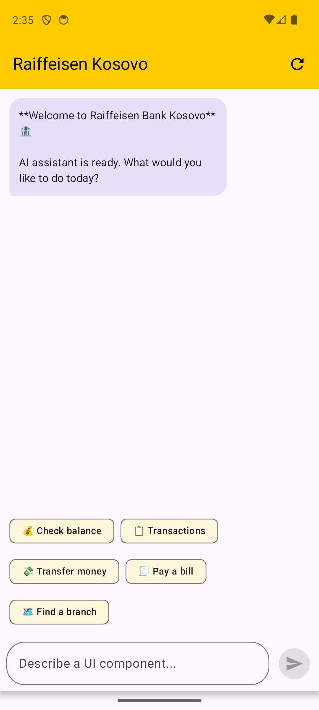
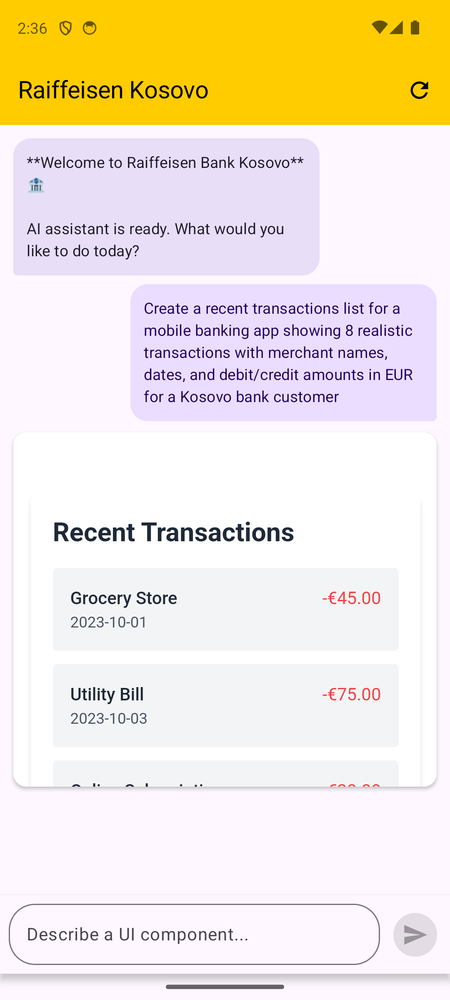
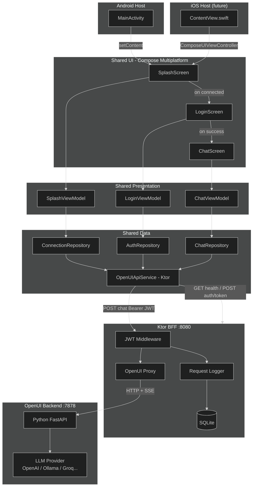
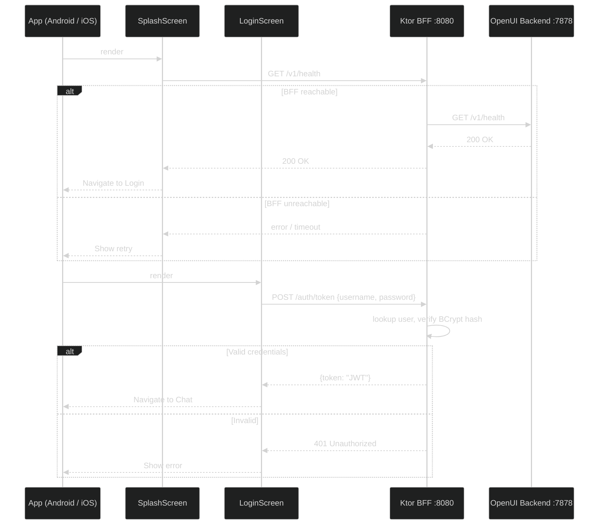
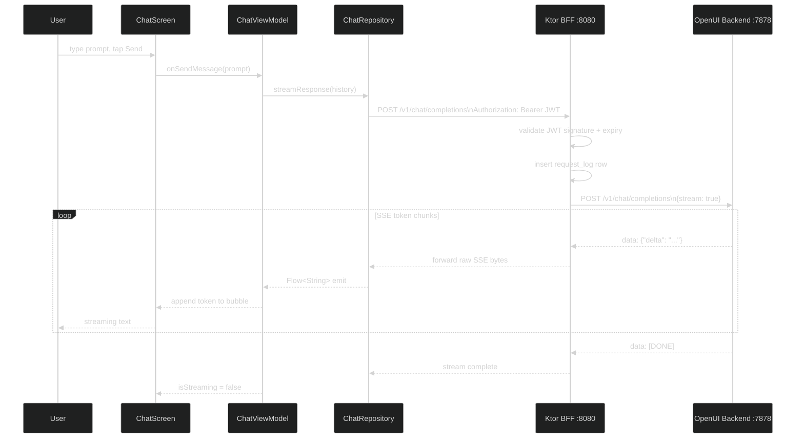
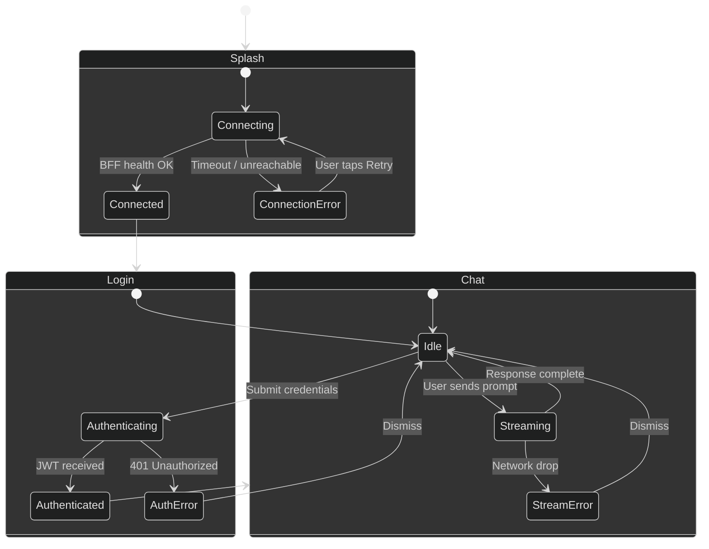

# OpenUI KMP Mobile App

A **Kotlin Multiplatform (KMP)** mobile application for Android and iOS that connects to a self-hosted [OpenUI](https://github.com/wandb/openui) backend - an open-source tool that lets you describe UI using your imagination and see it rendered live through a conversational LLM interface.

---

## Screenshots

| Welcome screen | Generated widget |
|---|---|
|  |  |

---

## Overview

OpenUI runs as a local Python server (port `7878`) backed by any LLM (OpenAI, Anthropic, Ollama, Groq, etc.). This app provides a native mobile front-end for that server:

1. A **splash screen** is shown while the app establishes a connection to the backend.
2. Once connected, a **chat window** opens where the user types prompts and receives streamed UI generation results.

---

## Tech Stack

| Layer | Technology |
|---|---|
| Shared code (logic + UI) | Kotlin Multiplatform + Compose Multiplatform |
| Android host app | Jetpack Compose (Material 3) |
| iOS host app | SwiftUI shell + Compose Multiplatform views (future) |
| BFF (Backend for Frontend) | Ktor 3 (JVM, standalone Gradle project) |
| BFF auth | JWT (HMAC-256) via `ktor-server-auth-jwt` |
| BFF database | SQLite via Exposed ORM |
| BFF migrations | Flyway (SQL files, classpath-based) |
| HTTP client | Ktor (multiplatform) |
| Streaming | Server-Sent Events (SSE) via Ktor |
| Async / state | Kotlin Coroutines + `StateFlow` |
| DI | Koin (multiplatform) |
| Serialization | `kotlinx.serialization` |
| Build | Gradle 8 + Kotlin 2.x |

> **UI sharing strategy:** Compose Multiplatform is used for all shared screens (Splash, Chat). Each platform host (Android Activity / iOS `UIHostingController`) embeds these composables. Platform-native chrome (status bar tinting, edge-to-edge, safe-area insets) is handled per-platform via `expect/actual`.

---

## Repository Structure

```
openui-explore/
+-- app/                           # Mobile application code (KMP)
|   +-- shared/                    # KMP shared module (logic + UI)
|   |   +-- commonMain/
|   |   |   +-- data/
|   |   |   |   +-- model/         # ChatMessage, ApiModels, AuthModels
|   |   |   |   +-- network/       # Ktor client, OpenUIApiService
|   |   |   |   +-- repository/    # ConnectionRepository, AuthRepository, ChatRepository
|   |   |   +-- presentation/
|   |   |   |   +-- splash/        # SplashViewModel, SplashState
|   |   |   |   +-- login/         # LoginViewModel, LoginState
|   |   |   |   +-- chat/          # ChatViewModel, ChatState
|   |   |   +-- ui/
|   |   |       +-- splash/        # SplashScreen composable
|   |   |       +-- login/         # LoginScreen composable
|   |   |       +-- chat/          # ChatScreen, MessageBubble composables
|   |   +-- androidMain/           # Android actuals (OkHttp engine)
|   |   +-- iosMain/               # iOS actuals (Darwin engine, future)
|   +-- androidApp/                # Android application module
|       +-- src/main/kotlin/
|           +-- MainActivity.kt    # Splash / Login / Chat navigation
|           +-- OpenUIApp.kt       # Koin init, BFF URL config
|           +-- di/ViewModelModule.kt
+-- backend/                       # All server-side code
|   +-- openui/                    # Git submodule: wandb/openui (Python backend)
|   |   +-- backend/               # Python package root
|   |       +-- Dockerfile         # Multi-stage uv build
|   |       +-- pyproject.toml
|   |       +-- openui/            # Python source - edit here for new features
|   +-- bff/                       # Ktor BFF - standalone Gradle project
|       +-- settings.gradle.kts    # Standalone (not part of the root project)
|       +-- build.gradle.kts
|       +-- Dockerfile
|       +-- src/main/
|           +-- kotlin/
|           |   +-- .../bff/
|           |       +-- Application.kt
|           |       +-- plugins/   # Auth, DB, Logging, Routing, Serialization
|           |       +-- routes/    # AuthRoutes, ProxyRoutes
|           |       +-- db/
|           |       |   +-- DatabaseFactory.kt
|           |       |   +-- tables/
|           |       +-- model/
|           +-- resources/
|               +-- application.conf
|               +-- logback.xml
|               +-- db/migration/
|                   +-- V1__create_users.sql
|                   +-- V2__create_request_logs.sql
+-- docker-compose.yml             # Dev environment (backend + BFF)
+-- .env.example                   # API key + JWT secret template
```

---

## Architecture

The app uses a strict **layered architecture** inside the shared KMP module:

```
UI (Compose) -> ViewModel -> Repository -> Network (Ktor) -> OpenUI Backend
```

All layers except the Ktor engine `actual` implementations are in `commonMain` and shared between platforms.

---

### High-Level Component Diagram



---

### App Launch, Auth, and Chat Flow



---

### Chat & Streaming Flow



---

### Screen & State Machine



---

## Key Design Decisions

### 1. Splash Screen Purpose
The splash screen actively pings `GET /v1/health` on the BFF. Navigation to Login only happens on a confirmed `200 OK`. This prevents the user reaching a broken experience if the BFF or OpenUI is down.

### 2. BFF as Auth and Proxy Layer
The Ktor BFF sits between the mobile app and OpenUI. It has two responsibilities:
- **Authentication:** Issues and validates JWT tokens. The mobile app never talks to OpenUI directly, so LLM API keys and the OpenUI URL are never exposed to the client.
- **Proxying:** Forwards all `/v1/*` requests to OpenUI verbatim, including raw SSE byte streams for streaming chat responses.

### 3. JWT Authentication
The BFF issues HMAC-256 signed JWTs with a configurable expiry (default 24 hours). The mobile app includes the token in `Authorization: Bearer <token>` on every proxied request. The BFF validates the signature and expiry before forwarding.

### 4. SQLite + Flyway Migrations
The BFF uses SQLite via the Exposed ORM for persistence. Schema changes are managed exclusively through Flyway SQL migration files in `backend/bff/src/main/resources/db/migration/`. Flyway runs on every startup and is idempotent. Exposed does not manage the schema.

Current tables:
- `users` - username + BCrypt-hashed password
- `request_logs` - per-request audit log (user, method, path, status code, duration)

### 5. SSE Streaming
OpenUI uses `POST /v1/chat/completions` with `"stream": true`, responding with `text/event-stream`. The BFF forwards the raw SSE byte channel from OpenUI directly to the mobile client using Ktor's `respondBytesWriter` + `copyTo`. The KMP shared module emits parsed tokens into a `Flow<String>`.

### 6. Backend URL Configuration
The mobile app points at the BFF. Default values:

| Context | BFF URL |
|---|---|
| Android Emulator | `http://10.0.2.2:8080` (default) |
| iOS Simulator (future) | `http://localhost:8080` |
| Physical device | LAN IP of the machine running Docker, e.g. `http://192.168.1.x:8080` |

### 7. Compose Multiplatform for UI Sharing
All screens (Splash, Login, Chat) are written once in `commonMain` using Compose Multiplatform. The Android host embeds them directly; the future iOS host wraps them in `ComposeUIViewController`.

---

## OpenUI API Endpoints Used

All mobile traffic goes through the BFF. The BFF exposes these endpoints to the app:

| Endpoint | Method | Auth | Purpose |
|---|---|---|---|
| `/v1/health` | `GET` | None | Splash: verify BFF + OpenUI are reachable |
| `/auth/token` | `POST` | None | Login: exchange credentials for JWT |
| `/v1/models` | `GET` | JWT | Chat: populate model selector |
| `/v1/chat/completions` | `POST` (SSE) | JWT | Chat: stream LLM response |

The BFF proxies `/v1/*` calls transparently to `OPENUI_BACKEND_URL`.

---

## Build Requirements

| Requirement | Version |
|---|---|
| Android Studio | Jellyfish+ |
| Xcode | 15+ (iOS, future) |
| Kotlin | 2.0+ |
| Gradle | 8.x |
| Android minSdk | 26 |
| iOS deployment target | 16.0+ (future) |
| Docker + Docker Compose | v2+ |
| Python (local backend dev, optional) | 3.12 via uv |
| JDK (local BFF dev) | 21+ |

---

## Backend Development

The OpenUI Python backend lives in `backend/` as a **git submodule** pointing at [wandb/openui](https://github.com/wandb/openui). Keeping it as a submodule means you can freely modify the source, commit your changes, and eventually point the submodule at your own fork without mixing backend and mobile history.

### First-time setup

```bash
# After cloning this repo, initialise the submodule
git submodule update --init --recursive

# Copy the env template and fill in at least one LLM API key
cp .env.example .env
```

Edit `.env` and set at least one of `OPENAI_API_KEY`, `ANTHROPIC_API_KEY`, `GROQ_API_KEY`, or `GEMINI_API_KEY`. Also review the BFF secrets (`JWT_SECRET`, `BFF_ADMIN_PASSWORD`) before any non-local deployment.

### Running with Docker Compose (recommended)

```bash
# Build both images from local source
docker compose build

# Start OpenUI backend + BFF
docker compose up
```

| Service | Port | Description |
|---|---|---|
| `backend` | 7878 | OpenUI Python server (hot-reload, dev only) |
| `bff` | 8080 | Ktor BFF - the only endpoint the mobile app talks to |

The Android emulator reaches the BFF at `http://10.0.2.2:8080` (already the default in `OpenUIApp.kt`).

**How hot-reload works for the backend:** `docker-compose.yml` bind-mounts `backend/openui/backend/openui/` over `/app/openui`. Edits to Python source are picked up immediately by uvicorn. A rebuild is only needed when `pyproject.toml` or `uv.lock` changes.

### Adding or modifying backend features

Edit files under `backend/openui/backend/openui/`, save, and the running container reloads automatically.

When you want to add a Python dependency:

```bash
cd backend/openui/backend
uv add <package>              # updates pyproject.toml + uv.lock
cd ../../..
docker compose build backend  # rebuild to install the new dep
```

### Pointing the submodule at your own fork

```bash
cd backend/openui
git remote add fork https://github.com/<you>/openui.git
git checkout -b my-feature
# ... make changes ...
git push fork my-feature
cd ../..
git add backend/openui
git commit -m "backend: advance submodule to my-feature"
```

---

## BFF Development

The BFF is a standalone Ktor application in `backend/bff/`. It has its own `settings.gradle.kts` so it can be built and dockerized independently of the KMP mobile project (no Android SDK required).

### Running the BFF locally (without Docker)

```bash
cd backend/bff

# Run with Gradle
./gradlew run
```

The BFF starts on port 8080 and reads config from `src/main/resources/application.conf`. Set env vars to override defaults:

```bash
OPENUI_BACKEND_URL=http://localhost:7878 \
JWT_SECRET=my-secret \
BFF_ADMIN_PASSWORD=mypassword \
./gradlew run
```

### Database migrations

Flyway runs automatically on startup. Migration files live at:

```
backend/bff/src/main/resources/db/migration/
    V1__create_users.sql
    V2__create_request_logs.sql
    V3__your_next_change.sql   <-- add new migrations here
```

Naming convention: `V{version}__{description}.sql`. Flyway tracks applied versions in the `flyway_schema_history` table and only runs new files. Never edit an already-applied migration - always create a new one.

### Adding a new BFF route

1. Add the route function in `backend/bff/src/main/kotlin/.../routes/`
2. Register it in `Routing.kt`
3. Wrap with `authenticate("jwt-auth") { ... }` if it requires a valid JWT

### App backend URL

The URL the Android app connects to is set in `app/androidApp/src/main/kotlin/com/dgurnick/openuiexplore/OpenUIApp.kt`:

| Context | URL |
|---|---|
| Android Emulator | `http://10.0.2.2:8080` (default) |
| iOS Simulator (future) | `http://localhost:8080` |
| Physical device | LAN IP of your machine, e.g. `http://192.168.1.x:8080` |

---

## Approach: Pros and Cons

This project uses an LLM to generate **TailwindCSS HTML components on-demand** inside a native mobile app, rendered via WebView. Below is an honest assessment of the trade-offs and practical solutions for each con.

### Overall Architecture

| # | Pro | Con | Solution |
|---|---|---|---|
| 1 | **Zero UI backlog** - describing a screen in natural language is faster than designing + coding it | **Non-deterministic output** - the same prompt can produce different HTML on each run | Cache rendered HTML keyed to a hash of the prompt. On repeat requests, serve the cached version and offer a "regenerate" button to intentionally refresh |
| 2 | **Highly flexible** - any UI pattern (maps, charts, forms, lists) is achievable with a good prompt | **No type safety** - the rendered widget is HTML/JS floating inside a WebView, disconnected from Kotlin state | Use the WebView `addJavascriptInterface` bridge to post structured JSON events (button taps, form values) back to Kotlin, then handle them in the ViewModel |
| 3 | **Rapid prototyping** - a designer or PM can demo a feature without writing any code | **Accessibility gaps** - generated HTML rarely includes ARIA roles, screen reader labels, or keyboard navigation | Extend the system prompt to explicitly require `aria-label`, `role`, and `tabindex` attributes. Post-process the HTML on the BFF to inject missing ARIA metadata via a lightweight HTML parser |
| 4 | **Model-agnostic** - swap GPT-4o for Claude, Llama, or Gemini by changing one env var | **Network dependency** - every widget render requires a live LLM API call; offline mode is impossible | Cache the most-recently generated HTML for each quick-action on the BFF (Redis or SQLite). Serve stale content with an "offline" badge when the LLM is unreachable |
| 5 | **BFF isolation** - API keys never reach the device; all LLM traffic is server-side | **Latency** - even streaming, a full widget takes 3-10 seconds to appear | Show a skeleton/shimmer placeholder immediately; stream tokens into the WebView progressively rather than waiting for the full response. Pre-generate common widgets at startup in the background |
| 6 | **Platform reuse** - one Kotlin codebase targets Android today and iOS tomorrow via KMP | **WebView overhead** - each rendered widget is a full browser instance; many open at once will pressure memory | Recycle WebView instances from a small pool (2-3). Destroy off-screen WebViews in `onDetach`. Favour `WKWebView` (iOS) and `WebView` (Android) which both share the system rendering process |
| 8 | **True interactive widgets** - unlike [Remote Compose](https://developer.android.com/develop/ui/compose/remote-compose) or server-driven UI JSON schemas, the generated HTML runs real JavaScript; dropdowns, forms, checkboxes, animations, and `onclick` handlers all work inside the WebView without any schema negotiation | **Widget interactions are isolated** - JS events inside the WebView don't automatically propagate to native Kotlin state; a tap on a "Pay" button inside the widget can't trigger native navigation without an explicit bridge | Use `addJavascriptInterface` to expose a typed Kotlin bridge (e.g. `NativeBridge.navigate(route)`, `NativeBridge.postEvent(json)`) and handle the calls in the ViewModel. This gives full interactivity while keeping native state in Kotlin |
| 7 | **Rapid iteration** - UI changes come from the LLM, not a mobile release | **WebView security posture** - embedding a full browser engine introduces a large attack surface; many banking-grade security policies (e.g. PCI-DSS, FAPI, internal AppSec guidelines) prohibit inline WebViews or require additional controls | Enforce `WebSettings.setAllowFileAccess(false)`, `setAllowContentAccess(false)`, and a strict Content Security Policy header on every generated page. Use `shouldInterceptRequest` on the BFF side to validate all URLs before load. For regulated deployments, replace the WebView renderer with a server-side HTML->native-component transpiler (e.g. emit a JSON component tree instead of raw HTML and render it with Compose) |
| 9 | **No native debugging needed for layout** - widget appearance is controlled by HTML/CSS, familiar to any web developer | **Debugging is significantly harder** - defects sit at the intersection of Kotlin/Compose, the WebView bridge, Android's rendering pipeline, and Tailwind's JIT, making root-cause analysis non-trivial. As a concrete example: a simple widget height/scroll defect in this prototype required over an hour of investigation across JS height APIs (`scrollHeight`, `offsetHeight`, `contentHeight * scale`), Compose state management, anonymous-vs-named JS interface classes, and Tailwind's async class application - a defect that would be a one-line fix in a native Compose layout | Invest in an in-app debug overlay (long-press on any widget) that shows the raw HTML, measured height, and WebView console logs. Add a BFF endpoint that returns the last generated HTML for a given session so it can be replayed in a browser DevTools environment outside the app |

---

### OpenAI Specifically

| # | Pro | Con | Solution |
|---|---|---|---|
| 1 | **Best HTML quality** - GPT-4o and GPT-4o-mini consistently follow the TailwindCSS system prompt and produce clean, well-structured markup | **Cost at scale** - GPT-4o is ~$5/M input tokens; a detailed banking widget prompt can exceed 1,500 tokens | Default to `gpt-4o-mini` (~$0.15/M); upgrade to `gpt-4o` only for complex prompts. Cache responses so identical prompts never hit the API twice. Limit conversation history sent to the LLM to the last N turns |
| 2 | **Reliable streaming** - OpenAI's SSE implementation is stable and well-documented; chunks arrive quickly | **Rate limits** - free and Tier-1 accounts have low RPM/TPM caps; a busy demo can hit them fast | Add an exponential-backoff retry in `ProxyRoutes.kt` on HTTP 429. Route overflow traffic to a secondary provider (Groq, Anthropic) via LiteLLM as a fallback |
| 3 | **Function calling / structured output** - future versions could use JSON mode to return metadata alongside HTML | **Data residency** - prompts and generated HTML are sent to OpenAI's servers; not suitable for sensitive PII in prompts | Strip or anonymise PII on the BFF before forwarding the prompt (e.g. replace real account numbers with fictitious ones). For regulated workloads, self-host a capable model via Ollama on a private server |
| 4 | **GPT-4o-mini is cheap** - at ~$0.15/M input tokens it is practical for interactive demos | **Model deprecation** - OpenAI retires models; hardcoded model names (`gpt-4o-mini`) will eventually need updating | Read the model name from `.env` (`OPENAI_DEFAULT_MODEL=gpt-4o-mini`). The BFF exposes it through `/v1/models` so the app always uses whatever the server advertises, requiring no mobile release to change models |
| 5 | **Context window** - 128k tokens means long conversation history fits without truncation | **Hallucinated Tailwind classes** - the model occasionally invents class names that Tailwind's JIT does not generate, producing unstyled elements | Switch from CDN JIT to a pre-built Tailwind CSS bundle (`tailwind.min.css`) that includes all utility classes. Alternatively, add a BFF post-processing step that runs the HTML through a headless Tailwind CLI to purge unknown classes and warn |
| 6 | **No local GPU required** - runs on any machine with internet access | **Vendor lock-in risk** - without the BFF abstraction layer, a provider change would require mobile app changes; the BFF mitigates this | The BFF already abstracts the provider. Route all calls through LiteLLM on the BFF side to get a single unified API across OpenAI, Anthropic, Groq, and Ollama with one config change |

---

### Self-hosted Alternatives (Ollama / LiteLLM)

| # | Pro | Con | Solution |
|---|---|---|---|
| 1 | **Free after hardware** - no per-token cost once you own the GPU | **Lower HTML quality** - smaller open-weight models (Mistral, Llama 3) follow the TailwindCSS system prompt less reliably than GPT-4o | Use a fine-tuned variant (e.g. `codellama` or `deepseek-coder`) which follows code-generation instructions more closely. Alternatively, use few-shot examples in the system prompt to show the expected HTML structure |
| 2 | **Data stays local** - no data leaves the network | **Speed** - consumer GPU inference is slower than OpenAI's hosted endpoints | Use quantised models (Q4_K_M GGUF) for a good quality/speed balance. Enable GPU offloading in Ollama (`OLLAMA_NUM_GPU=1`). Show a streaming skeleton UI so the user sees progress immediately |
| 3 | **No rate limits** | **Setup friction** - requires Ollama or LiteLLM running alongside Docker Compose | Add an `ollama` service to `docker-compose.yml` so `docker compose up` starts everything in one command. Document GPU passthrough (`deploy.resources.reservations.devices`) for NVIDIA and Apple Silicon hosts |


